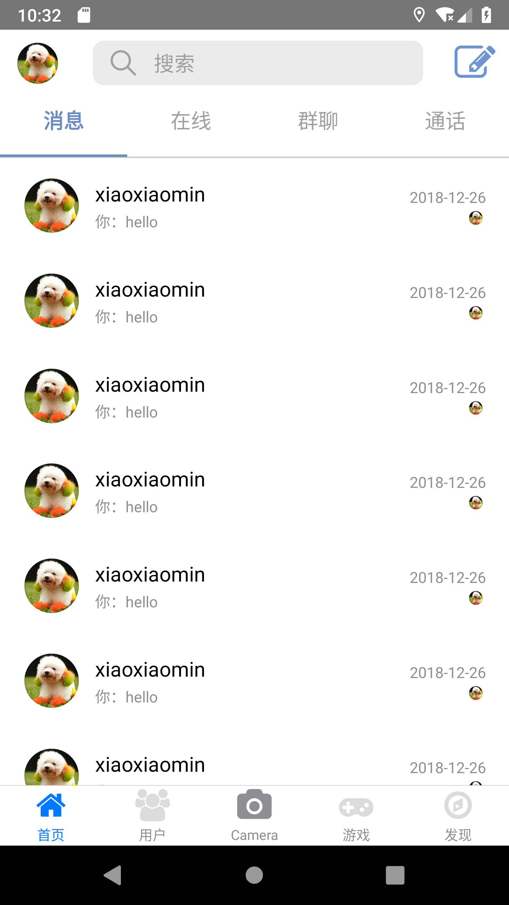

A React Native project which is imitate Messager App.

## Installation

```
git clone https://github.com/tykdn/Messenger.git`
```
with yarn
```
yarn
```
or with npm:
```
npm install
```
```
npm link
```

## Usage

In the project directory:<br/>

run the app
```
npm start
```
format code
```
npm run prettier
```
build android apk
```
npm run build_android
```
##  Screenshot of the currently completed part





