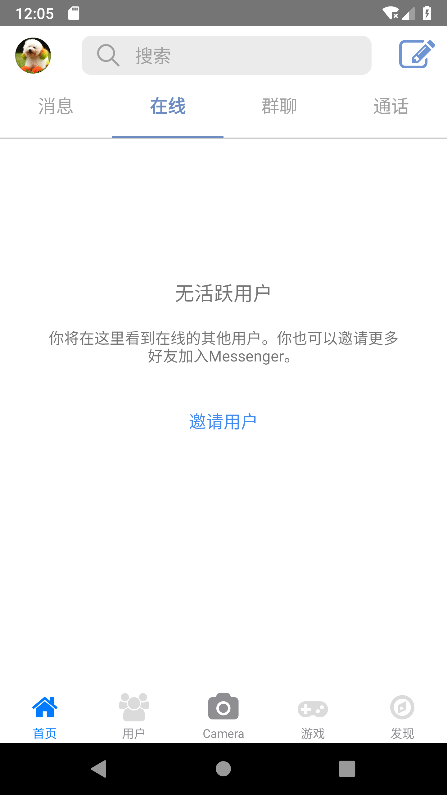
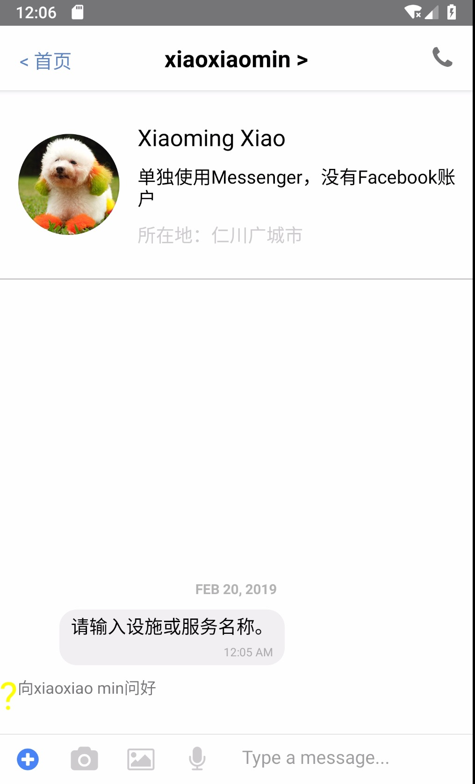
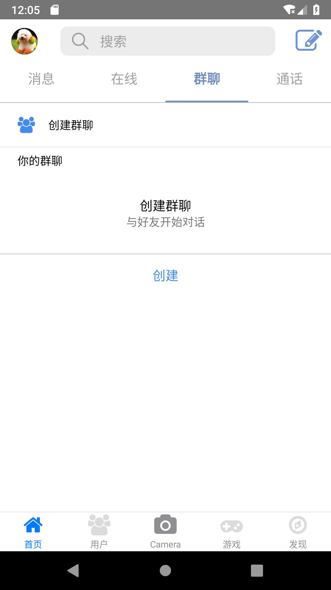
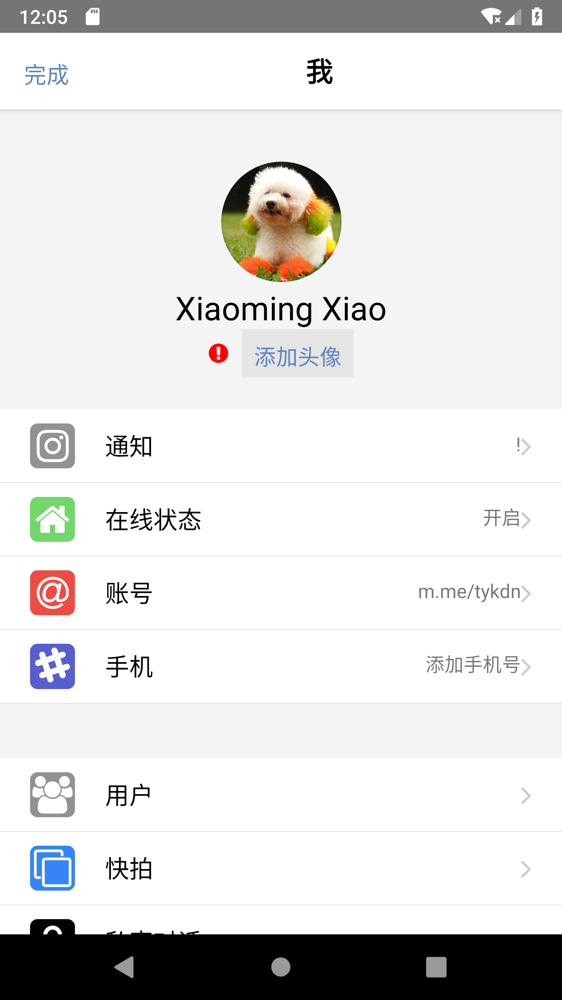
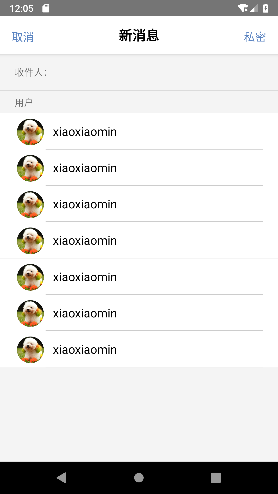

A React Native App which is imitate Messenger App of old version after 200.0.

old project [Messenger-old](https://github.com/tykdn/Messenger-old).

## Installation

```
git clone https://github.com/tykdn/Messenger.git`
```
with yarn
```
yarn
```
or with npm:
```
npm install
```
```
npm link
```

## Usage

In the project directory:<br/>

run the app
```
npm start
```
format code
```
npm run prettier
```
build android apk
```
npm run build_android
```
##  Screenshot of the currently completed part


<div style="display:flex;">
  
  
  
</div>
<div style="display:flex;justify-content:space-around">
  
  
  
</div>
<div style="display:flex;justify-content:space-around">
  
  
</div>

## License

- [MIT](LICENSE)

